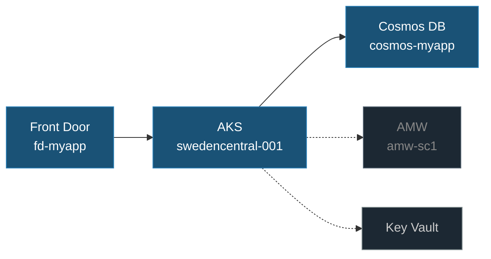

# Health Model Architecture Mapping

Transform discovered resources into an architecture graph with dependency edges, classify resources by impact, and propose an entity hierarchy. Uses only `az resource list`, `az monitor`, and `jq`.

## Rules

### Mandatory checklist

1. ⛔ MANDATORY: `.healthmodel/01-discovery.json`, `.healthmodel/resources.json`, and `.healthmodel/00-brief.md` must exist **and contain real data**. Check that `01-discovery.json` has a `subscription` field, `resources.json` has at least one resource, and `00-brief.md` has user-filled content (not just the template placeholders). If any file is missing, empty, or still contains only placeholder values, **stop immediately** and tell the user: *"Discovery has not been completed. Load `healthmodel-discovery` first."* Do NOT attempt to create or fill these files yourself.
2. ⛔ MANDATORY: Use Mermaid with `<br/>` (never `\n`) and dark-mode-safe class colors.
3. ⛔ MANDATORY: Each entity has at most one parent (tree, not DAG).
4. ⛔ MANDATORY: Save the graph first, then present the proposed hierarchy to the user for confirmation. If the user requests changes, update and re-save before handing off.

## Prerequisites

```bash
# Files must exist AND contain real data
test -f .healthmodel/01-discovery.json && test -f .healthmodel/resources.json && test -f .healthmodel/00-brief.md \
  || { echo "STOP: Discovery files missing — run healthmodel-discovery first"; exit 1; }

# discovery.json must have a real subscription ID (UUID format)
jq -e '.subscription | test("^[0-9a-f]{8}-")' .healthmodel/01-discovery.json >/dev/null 2>&1 \
  || { echo "STOP: 01-discovery.json has no valid subscription — run healthmodel-discovery"; exit 1; }

# resources.json must have actual Azure resource IDs (not placeholders)
jq -e '[.[] | select(.id | test("^/subscriptions/[0-9a-f]{8}-"))] | length > 0' .healthmodel/resources.json >/dev/null 2>&1 \
  || { echo "STOP: resources.json has no real Azure resources — run healthmodel-discovery export against a live subscription"; exit 1; }

# brief §1 Azure Scope must have a real subscription ID filled in
grep -qE '[0-9a-f]{8}-[0-9a-f]{4}-' .healthmodel/00-brief.md 2>/dev/null \
  || { echo "STOP: 00-brief.md has no Azure subscription — user must fill in §1 Azure Scope"; exit 1; }

command -v jq >/dev/null
```

## Steps

### Step 1: Build Dependency Graph

Extract implicit relationships by resource type. For each, produce edges `{from, to, kind}` where kind ∈ `serves|stores|authenticates|monitors`.

```bash
# AKS → data stores
jq '[.[] | select(.type | test("DocumentDB|Sql/servers|DBforPostgreSQL"))] | map({name, type, id})' \
  .healthmodel/resources.json

# Monitoring plane
jq '[.[] | select(.type=="Microsoft.Monitor/accounts")] | map({name, id})' .healthmodel/resources.json
```

For Front Door / App Gateway, match origin hostnames to compute resources.

### Step 2: Classify Impact

Read `.healthmodel/00-brief.md` before classifying:

- **§4 Top Concerns** — concern #1 maps to `Standard` impact (failure turns parent red); concerns ranked lower map to `Limited`. Anything not mentioned and not on the request path defaults to `Limited` or `Suppressed`.
- **§2 Critical User Journeys** — if filled, derive the critical path from the journeys' `Depends on` column instead of guessing from resource types.
- **§7 Stamp & Regional Behavior** — drives stamp entity structure: independent stamp health = per-stamp subtree; flat = single tree with stamp-tagged signals. "One stamp down = Unhealthy" vs "Degraded" controls whether stamp rollup gates the root.
- **§8 Environment & Exclusions** — drop excluded resources from the graph before classifying.

If the brief is not filled in or sections are blank, fall back to the defaults listed in the brief's §9.

| Position | Impact | Meaning |
|----------|--------|---------|
| Request path (ingress → compute → data) | `Standard` | Failure turns parent red |
| Side dependency (cache, queue, AI) | `Limited` | Visible, doesn't escalate |
| Telemetry/monitoring (AMW, Log Analytics) | `Suppressed` | Informational |

**Critical path** = longest directed path from any public ingress to a stateful node — *unless* §2 of the brief specifies user journeys, in which case the critical path follows the journeys.

### Step 3: Generate Mermaid Diagram

Save to `.healthmodel/02-architecture.md`:



Also include a resource inventory table and an explicit critical-path call-out.

### Step 4: Propose Entity Hierarchy

Pick the pattern matching the discovery answers.

**Pattern A — AKS microservices, multi-stamp**
```
Root (<appName>)
├── Failures        (Suppressed — aggregates error signals)
│   ├── <stamp> — AKS Failures
│   ├── <stamp> — Pod Failures
│   ├── <stamp> — Front Door Errors
│   └── <stamp> — Cosmos Errors
├── Latency         (Limited — aggregates latency signals)
│   ├── <stamp> — Gateway Latency
│   ├── <stamp> — Cosmos Latency
│   └── <stamp> — FD Latency
├── Resource Pressure (per stamp)
└── Side groups (Queues, AI, Certificates if present)
```

**Pattern B — PaaS (App Service + SQL/Cosmos)**
```
Root
├── Frontend (App Service errors, latency, CPU, memory)
├── Database (DTU/RU, errors, latency)
├── Ingress (5xx, origin latency)
└── Telemetry (Suppressed)
```

**Pattern C — Event-driven (Functions + Service Bus)**
```
Root
├── Producers (HTTP errors, latency)
├── Bus (dead letters, throttling, server errors)
└── Consumers (failed executions, processing latency)
```

### Step 5: Save (draft)

Save the graph and diagram files now (same format as final output — see below). This ensures the design phase can proceed even if the session is interrupted.

### Step 6: Review with User

Ask:
- Does this tree match your architecture?
- Any entities to add/remove?
- Are the impact levels right?

If the user requests changes, update the files and re-save before handing off.

### Step 7: Finalize

`.healthmodel/02-graph.json`:
```json
{
  "nodes": [
    {"id": "<resource-id>", "type": "Microsoft.ContainerService/managedClusters", "role": "critical", "stamp": "sc-001"}
  ],
  "edges": [
    {"from": "<fd-id>", "to": "<aks-id>", "kind": "serves"}
  ],
  "entityHierarchy": {
    "root": "Root",
    "children": [
      {"name": "Failures", "impact": "Suppressed", "children": []},
      {"name": "Latency", "impact": "Limited", "children": []}
    ]
  }
}
```

## Next Step

Announce: *"Architecture mapped. `.healthmodel/02-graph.json` and `.healthmodel/02-architecture.md` are written. Load `healthmodel-design` to continue."* Then stop — do not auto-proceed.

## Error Handling

| Error | Cause | Fix |
|-------|-------|-----|
| `01-discovery.json` missing | Discovery phase skipped | Run **healthmodel-discovery** first |
| No edges produced | Resources isolated / no naming convention | Ask user to identify relationships manually |
| Mermaid renders blank in dark mode | Default colors invisible | Use the `classDef` colors shown above |
| Cyclic dependency detected | DAG instead of tree | Break the cycle by promoting one node to root or side group |
