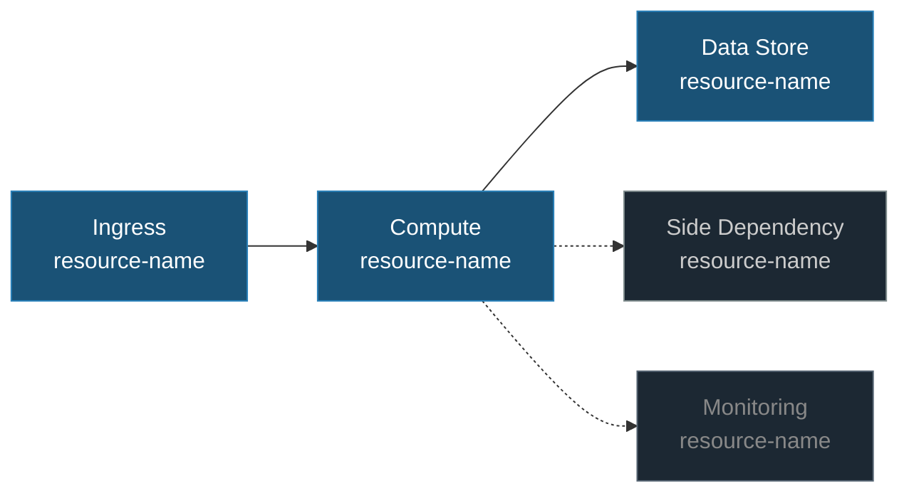

# Health Model Architecture Mapping

Transform discovered resources into an architecture graph with dependency edges, classify resources by impact, and propose an entity hierarchy. Uses only `az resource list`, `az monitor`, and `jq`.

## Rules

### Mandatory checklist

1. ⛔ MANDATORY: `.healthmodel/01-discovery.json`, `.healthmodel/resources.json`, and `.healthmodel/00-brief.md` must exist **and contain real data**. Check that `01-discovery.json` has a `subscription` field, `resources.json` has at least one resource, and `00-brief.md` has user-filled content (not just the template placeholders). If any file is missing, empty, or still contains only placeholder values, **stop immediately** and tell the user: *"Discovery has not been completed. Load `healthmodel-discovery` first."* Do NOT attempt to create or fill these files yourself.
2. ⛔ MANDATORY: Use Mermaid with `<br/>` (never `\n`) and dark-mode-safe class colors.
3. ⛔ MANDATORY: Each entity has at most one parent (tree, not DAG).
4. ⛔ MANDATORY: Save the graph first, then present the proposed hierarchy to the user for confirmation. If the user requests changes, update and re-save before handing off.

## Prerequisites

```bash
# Files must exist AND contain real data
test -f .healthmodel/01-discovery.json && test -f .healthmodel/resources.json && test -f .healthmodel/00-brief.md \
  || { echo "STOP: Discovery files missing — run healthmodel-discovery first"; exit 1; }

# discovery.json must have a real subscription ID (UUID format)
jq -e '.subscription | test("^[0-9a-f]{8}-")' .healthmodel/01-discovery.json >/dev/null 2>&1 \
  || { echo "STOP: 01-discovery.json has no valid subscription — run healthmodel-discovery"; exit 1; }

# resources.json must have actual Azure resource IDs (not placeholders)
jq -e '[.[] | select(.id | test("^/subscriptions/[0-9a-f]{8}-"))] | length > 0' .healthmodel/resources.json >/dev/null 2>&1 \
  || { echo "STOP: resources.json has no real Azure resources — run healthmodel-discovery export against a live subscription"; exit 1; }

# brief §1 Azure Scope must have a real subscription ID filled in
grep -qE '[0-9a-f]{8}-[0-9a-f]{4}-' .healthmodel/00-brief.md 2>/dev/null \
  || { echo "STOP: 00-brief.md has no Azure subscription — user must fill in §1 Azure Scope"; exit 1; }

command -v jq >/dev/null
```

## Steps

### Step 1: Build Dependency Graph

Start from **all** discovered resources in `.healthmodel/resources.json` — do not filter by expected types. Every resource in the file is a candidate for the graph.

#### 1a. Enumerate all resources and classify by role

```bash
# List all distinct resource types and counts
jq 'group_by(.type) | map({type: .[0].type, count: length}) | sort_by(-.count)' \
  .healthmodel/resources.json

# For any resource type you don't immediately recognize, research it:
# - What does this service do?
# - Is it on the request path, a background service, or infrastructure?
# - What kind of health signals would matter for it?
```

For each resource, determine its **role** in the architecture. Use `.healthmodel/00-brief.md` (especially §2 Critical User Journeys and §4 Top Concerns) as the primary guide. When the brief doesn't cover a resource, research the resource type and ask the user.

#### 1b. Infer relationships

Produce edges `{from, to, kind}` where kind ∈ `serves|stores|authenticates|monitors|calls|feeds`.

Relationship inference strategies (use all that apply):
- **Naming conventions**: resources with matching prefixes/suffixes likely belong together
- **Resource group co-location**: resources in the same RG are often related
- **Known Azure patterns**: ingress resources serve compute, compute calls data stores, compute calls AI services, etc.
- **Tags**: `tags.environment`, `tags.application`, `tags.stamp` reveal groupings
- **Network topology** (if Resource Graph data available): subnet co-location, private endpoints
- **Brief §2**: user-described journeys define the actual call chain — prefer these over inferred relationships

Do **not** assume a fixed topology. The architecture could be anything: microservices, monolith, event-driven, AI pipeline, batch processing, IoT, or a combination.

### Step 2: Classify Impact

Read `.healthmodel/00-brief.md` before classifying:

- **§4 Top Concerns** — concern #1 maps to `Standard` impact (failure turns parent red); concerns ranked lower map to `Limited`. Anything not mentioned and not on the request path defaults to `Limited` or `Suppressed`.
- **§2 Critical User Journeys** — if filled, derive the critical path from the journeys' `Depends on` column instead of guessing from resource types.
- **§7 Stamp & Regional Behavior** — drives stamp entity structure: independent stamp health = per-stamp subtree; flat = single tree with stamp-tagged signals. "One stamp down = Unhealthy" vs "Degraded" controls whether stamp rollup gates the root.
- **§8 Environment & Exclusions** — drop excluded resources from the graph before classifying.

If the brief is not filled in or sections are blank, fall back to the defaults listed in the brief's §9.

Impact is determined by **the resource's role in the user's architecture**, not by its Azure type:

| Principle | Impact | Meaning |
|-----------|--------|---------|
| On the critical request path — user request fails if this is down | `Standard` | Failure turns parent red |
| Supports the request path but has fallback/degraded mode | `Limited` | Visible degradation, doesn't escalate |
| Background/async processing — users don't notice immediately | `Limited` | Visible, doesn't escalate |
| Telemetry, monitoring, management infrastructure | `Suppressed` | Informational |

> **Any** resource type can be `Standard` — an Azure OpenAI service powering a chatbot, a PostgreSQL database holding user sessions, a Storage account serving static assets. Don't assume impact from the resource type alone. The brief and the user's architecture determine impact.

**Critical path** = longest directed path from any public ingress to a stateful node — *unless* §2 of the brief specifies user journeys, in which case the critical path follows the journeys.

### Step 3: Generate Mermaid Diagram

Build the diagram from the actual discovered resources and inferred relationships — not from a template. Save to `.healthmodel/02-architecture.md`:



Use the actual resource names from `resources.json`. The diagram should reflect the real topology — add or remove nodes and edges as the architecture demands.

Also include a resource inventory table and an explicit critical-path call-out.

### Step 4: Propose Entity Hierarchy

Design a hierarchy that reflects the **actual architecture**, not a predefined template. The hierarchy should group resources by their role in the system and the golden signals that matter for each group.

**Guiding principles:**
- Group by **function** (what it does for the user), not by Azure resource type
- Leaf entities carry signal groups; branch entities aggregate health from children
- Each entity has at most one parent (tree, not DAG)
- 2-4 signals per leaf entity (one per relevant golden-signal category)
- Name entities after their role ("Payment Processing", "Document Ingestion"), not their Azure type ("Cosmos DB", "Storage Account")

**Example hierarchies** — these are illustrations, not templates. Your architecture will likely differ:

*Microservices with multi-stamp:*
```
Root (<appName>)
├── Failures        (aggregates error signals across stamps)
├── Latency         (aggregates latency signals across stamps)
├── Resource Pressure (per stamp)
└── Side groups (as needed)
```

*PaaS web app:*
```
Root
├── Frontend (errors, latency, resource usage)
├── Database (availability, query performance)
├── Ingress (error rate, origin latency)
└── Telemetry (Suppressed)
```

*Event-driven processing:*
```
Root
├── Producers (HTTP errors, latency)
├── Message Bus (dead letters, throttling)
└── Consumers (execution failures, processing latency)
```

*AI-powered application (e.g., RAG chatbot):*
```
Root
├── Frontend (errors, latency, resource usage)
├── AI Inference (request rate, latency, throttling, content safety)
├── Knowledge Base (search latency, indexer health, throttling)
├── Data Store (availability, latency)
└── Telemetry (Suppressed)
```

*Batch/ETL pipeline:*
```
Root
├── Ingestion (trigger rate, failures, queue depth)
├── Processing (execution time, error rate, resource usage)
├── Output (write latency, failures)
└── Orchestration (pipeline status, scheduling)
```

These are starting points. Combine, modify, or ignore them entirely based on what `resources.json` and the brief tell you. If the architecture doesn't fit any pattern, design the hierarchy from scratch — the user confirms in Step 6.

### Step 5: Save (draft)

Save the graph and diagram files now (same format as final output — see below). This ensures the design phase can proceed even if the session is interrupted.

### Step 6: Review with User

Ask:
- Does this tree match your architecture?
- Any entities to add/remove?
- Are the impact levels right?

If the user requests changes, update the files and re-save before handing off.

### Step 7: Finalize

`.healthmodel/02-graph.json`:
```json
{
  "nodes": [
    {"id": "<resource-id>", "type": "Microsoft.ContainerService/managedClusters", "role": "critical", "stamp": "sc-001"}
  ],
  "edges": [
    {"from": "<fd-id>", "to": "<aks-id>", "kind": "serves"}
  ],
  "entityHierarchy": {
    "root": "Root",
    "children": [
      {"name": "Failures", "impact": "Suppressed", "children": []},
      {"name": "Latency", "impact": "Limited", "children": []}
    ]
  }
}
```

## Next Step

Announce: *"Architecture mapped. `.healthmodel/02-graph.json` and `.healthmodel/02-architecture.md` are written. Load `healthmodel-design` to continue."* Then stop — do not auto-proceed.

## Error Handling

| Error | Cause | Fix |
|-------|-------|-----|
| `01-discovery.json` missing | Discovery phase skipped | Run **healthmodel-discovery** first |
| No edges produced | Resources isolated / no naming convention | Ask user to identify relationships manually |
| Mermaid renders blank in dark mode | Default colors invisible | Use the `classDef` colors shown above |
| Cyclic dependency detected | DAG instead of tree | Break the cycle by promoting one node to root or side group |
