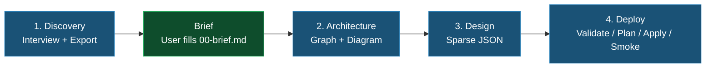

# Health Model Orchestrator

End-to-end workflow for creating and adapting an Azure Monitor Health Model. Uses **only** the standard `az` CLI (`az resource`, `az rest`, `az bicep`) plus `jq` — no extensions, no Python SDK, no ARM template deployments.

## Rules

1. ⛔ MANDATORY: Discovery MUST always run before architecture — no exceptions. For later phases (design, deploy), direct entry is allowed ONLY if all required input contracts (checkpoint files) are present and validated.
2. ⛔ MANDATORY: Stop at each human checkpoint and wait for user approval before continuing.
3. ⛔ MANDATORY: All intermediate state goes to `.healthmodel/` checkpoint files. Never hold state in memory between phases.
4. ⛔ MANDATORY: Refuse to operate across multiple Azure subscriptions in a single model.
5. ⛔ MANDATORY: Provider `Microsoft.CloudHealth` must be registered before deploy. `bash .agents/skills/healthmodel-deploy/scripts/bootstrap.sh` does this; manual: `az provider register -n Microsoft.CloudHealth`.

## Prerequisites

```bash
# Azure CLI authenticated
az account show -o json | jq '{subscriptionId: .id, name: .name}'

# Required tooling (ships with modern az)
command -v jq >/dev/null  && echo "jq: ok"
az bicep version          # used offline by deploy to validate schemas

# Provider — needed for deploy phase, bootstrap.sh handles it
az provider show -n Microsoft.CloudHealth --query registrationState -o tsv
```

No CLI extensions required. No Python SDK. No ARM templates.

## Workflow



Skills are loaded by semantic/keyword matching against each skill's `description` metadata (intent-level match, not exact-string equality), not called like functions. To hand off, tell the user which skill is next and which files it expects — then stop. The user (or agent harness) will load the next skill, which sees the checkpoint files on disk and resumes.

### Phase 1: Discovery — `healthmodel-discovery`
- Input contract: user answers + active Azure subscription
- Output contract: `.healthmodel/00-brief.md` + `.healthmodel/01-discovery.json` + `.healthmodel/resources.json`
- **Checkpoint**: Brief template written to `.healthmodel/00-brief.md`. User fills sections 1-4 and 6-8 (SLOs, journeys, concerns, alert philosophy, stamp behavior, exclusions) and confirms before proceeding.
- Handoff: *"Discovery complete and brief confirmed. Load `healthmodel-architecture` to continue."*

### Phase 2: Architecture — `healthmodel-architecture`
- Input contract: `.healthmodel/01-discovery.json`, `.healthmodel/resources.json`
- Output contract: `.healthmodel/02-architecture.md` (Mermaid) + `.healthmodel/02-graph.json`
- **Checkpoint**: Show diagram + hierarchy, ask for corrections.
- Handoff: *"Architecture approved. Load `healthmodel-design` to continue."*

### Phase 3: Design — `healthmodel-design` (reads `healthmodel-signal-catalog`)
- Input contract: `.healthmodel/02-graph.json` + `.healthmodel/01-discovery.json`
- Output contract: **sparse** design files under `.healthmodel/03-design/{auth,signals,entities,relationships}/*.json` — each file contains only the `properties` body, only the fields the skill manages.
- **Checkpoint**: Show entity tree with signal counts and thresholds. Ask *"Ready to deploy?"*
- Handoff: *"Design approved. Load `healthmodel-deploy` and start with `.agents/skills/healthmodel-deploy/scripts/validate.sh`."*

### Phase 4: Deploy — `healthmodel-deploy`
- Input contract: `.healthmodel/03-design/` (sparse files)
- Pipeline: `validate.sh` (offline Bicep schema check) → `bootstrap.sh` (create model root, optionally attach UAMI) → RBAC setup (if UAMI) → `plan.sh` (GET live, merge, diff) → human checkpoint → `apply.sh` (PUT confirmed items, write receipt) → `smoke.sh` (read entity signal health)
- Output contract: live model in Azure + `.healthmodel/04-plan.json` + `.healthmodel/04-deployed.json`
- **Granular by design**: every apply only touches resources whose merged body differs from live; unmanaged fields (portal edits) are preserved.

## Checkpoint Files

| File | Phase | Content |
|---|---|---|
| `00-brief.md` | 1 | Human-authored brief: role, journeys, SLOs, concerns, alert philosophy, stamp behavior, exclusions |
| `01-discovery.json` | 1 | Interview answers + resource inventory |
| `resources.json` | 1 | Minimal resource projections |
| `raw/*.json` | 1 | Full `az resource list` output per RG |
| `02-architecture.md` | 2 | Mermaid diagram + resource table |
| `02-graph.json` | 2 | Dependency graph + entity hierarchy |
| `03-design/auth/*.json` | 3 | Sparse authenticationSettings bodies |
| `03-design/signals/*.json` | 3 | Sparse signalDefinitions bodies |
| `03-design/entities/*.json` | 3 | Sparse entities bodies |
| `03-design/relationships/*.json` | 3 | Sparse relationships bodies |
| `04-plan.json` | 4 | Per-resource verdict (`+`/`~`/`=`) + merged body |
| `04-deployed.json` | 4 | Apply receipt |

Users can re-run any phase independently, edit JSON, version-control `.healthmodel/` (note: `raw/` is gitignored — it may contain sensitive RBAC data), or resume after interruption.

## Quick Start

Experienced users can hand-author `.healthmodel/01-discovery.json` and jump to Phase 2, or hand-author sparse files under `.healthmodel/03-design/` and jump straight to Phase 4 — provided the required checkpoint files for that phase exist and are valid (see Input Contract per phase above).

## After Deployment — read-only inspection

All standard `az rest` against the ARM endpoints. No extension required:

```bash
SUB=$(az account show --query id -o tsv); RG=…; MODEL=…
API=2026-01-01-preview
BASE="https://management.azure.com/subscriptions/$SUB/resourceGroups/$RG/providers/Microsoft.CloudHealth/healthModels/$MODEL"

# List entities / signals / relationships
az rest --method GET --url "$BASE/entities?api-version=$API"          | jq '.value[].name'
az rest --method GET --url "$BASE/signalDefinitions?api-version=$API" | jq '.value[].name'
az rest --method GET --url "$BASE/relationships?api-version=$API"     | jq '.value[].name'

# Read signal health from entity state (the /execute endpoint does NOT exist)
az rest --method GET --url "$BASE/entities/<entity>?api-version=$API" \
  | jq '.properties.signalGroups | to_entries[].value.signals[]? | {name, healthState: .status.healthState}'

# Re-run the deploy smoke against the whole model
bash .agents/skills/healthmodel-deploy/scripts/smoke.sh "$RG" "$MODEL"
```

For continuous "watch", poll the entities endpoint on a cadence:

```bash
while :; do
  az rest --method GET --url "$BASE/entities?api-version=$API" \
    | jq -r '.value[] | "\(.properties.healthState // "?")\t\(.name)"'
  sleep 30; echo "---"
done
```

## Adapting an Existing Model

If someone created the model in the portal or hand-edited it between runs of this workflow: just re-run phases 3 and 4. Sparse design = the skill only touches fields it explicitly asserts. Plan output shows exactly what will change. To stop the skill from managing a field tuned in the portal, **remove that field from the design file**. See `healthmodel-deploy/SKILL.md` § "Adapting an existing model" for details.

## Error Handling

| Error | Cause | Fix |
|---|---|---|
| `az: command not found` | Azure CLI missing | Install: <https://docs.microsoft.com/cli/azure/install-azure-cli> |
| `az bicep` errors | Bicep not installed | `az bicep install` (then it ships with `az` going forward) |
| Cross-subscription resources detected | User mixed subscriptions | Refuse; ask user to pick one |
| Checkpoint file invalid or corrupted | Required `.healthmodel/` file exists but is malformed, missing required fields, or does not satisfy the next phase input contract | Stop immediately, identify the exact file and validation failure, ask the user to repair or regenerate it by re-running the producing phase, then retry only after the file validates |
| `Microsoft.CloudHealth` not registered | Provider not yet registered in subscription | `az provider register -n Microsoft.CloudHealth` (or run `bash .agents/skills/healthmodel-deploy/scripts/bootstrap.sh`) |
| `validate.sh` BCP errors | Sparse design uses wrong field/type/shape for the `2026-01-01-preview` schema | Read the BCP message — it names the exact field; fix the design file |
| Plan shows unexpected `~ modify` | Design asserts a field someone tuned in the portal | Either accept (apply will overwrite) or remove the field from the design (ownership release) |
