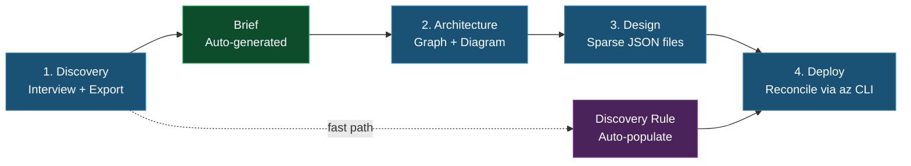

# Health Model Orchestrator

End-to-end workflow for creating and adapting an Azure Monitor Health Model. Uses the **`az monitor health-models`** CLI extension exclusively — no Bicep, no ARM templates, no Python SDK.

## Guiding Principles (from Azure Well-Architected service guide)

These principles shape every phase. Reference: [Azure Monitor Health Models service guide](https://learn.microsoft.com/en-us/azure/well-architected/service-guides/azure-monitor-health-models).

1. **Top-down, use-case-driven design** — Start from user journeys and SLOs, not from the resource list. The health model answers "is *this scenario* healthy?" not "are all my resources green?". Discovery interviews the user about their critical paths first.
2. **"Fits my screen"** — A health model should be comprehensible at a glance. If the entity tree doesn't fit on one screen, it has too many nodes. Group resources into meaningful aggregates; don't create one entity per resource.
3. **Don't monitor everything** (opinionated mode) — Pick the 3–5 signals per entity that actually indicate health. Avoid metric sprawl. Every signal should answer "would I page someone for this?" If not, it's noise.
4. **Health models as learning tools** (exploration mode) — When the user selects exploration mode, the model surfaces ALL discoverable metrics with permissive thresholds. The goal is observability literacy, not alerting. The user observes real metric behavior and graduates to an opinionated model later.

## Rules

1. ⛔ MANDATORY: The `health-models` Azure CLI extension must be installed. The deploy phase's `bootstrap.sh` does this; manual fallback: `az extension add --name health-models --yes`.
2. ⛔ MANDATORY: Discovery MUST always run before architecture — no exceptions. For later phases (design, deploy), direct entry is allowed ONLY if all required input contracts (checkpoint files) are present and validated.
3. ⛔ MANDATORY: Stop at each human checkpoint and wait for user approval before continuing.
4. ⛔ MANDATORY: All intermediate state goes to `.healthmodel/` checkpoint files. Never hold state in memory between phases.
5. ⛔ MANDATORY: Refuse to operate across multiple Azure subscriptions in a single model.
6. ⛔ MANDATORY: Provider `Microsoft.CloudHealth` must be registered before deploy. `bootstrap.sh` does this; manual: `az provider register -n Microsoft.CloudHealth`.

## Prerequisites

```bash
# Azure CLI authenticated
az account show -o json | jq '{subscriptionId: .id, name: .name}'

# Required tooling
command -v jq >/dev/null && echo "jq: ok"

# Install the extension if missing — exits 0 if already installed
az extension show --name health-models >/dev/null 2>&1 || az extension add --name health-models --yes

# Verify the command surface is loaded
az monitor health-models --help >/dev/null
```

If `az monitor health-models --help` fails, the deploy phase will not work. Run the bootstrap script directly: `bash .agents/skills/healthmodel-deploy/scripts/bootstrap.sh`.

## Workflow


```mermaid
graph LR
  classDef phase fill:#1a5276,stroke:#2980b9,color:#fff
  classDef check fill:#0e4d2c,stroke:#27ae60,color:#fff
  classDef optional fill:#4a235a,stroke:#8e44ad,color:#fff
  D[1. Discovery<br/>Interview + Export]:::phase --> B[Brief<br/>Auto-generated]:::check
  B --> A[2. Architecture<br/>Graph + Diagram]:::phase
  A --> S[3. Design<br/>Sparse JSON files]:::phase
  S --> P[4. Deploy<br/>Reconcile via az CLI]:::phase
  D -.fast path.-> F[Discovery Rule<br/>Auto-populate]:::optional
  F --> P
```

Skills are loaded by semantic/keyword matching against each skill's `description` metadata, not called like functions. To hand off, tell the user which skill is next and which files it expects — then stop. The user (or agent harness) loads the next skill, which sees the checkpoint files on disk and resumes.

### Phase 1: Discovery — `healthmodel-discovery`
- Input contract: user answers + active Azure subscription
- Output contract: `.healthmodel/00-brief.md` + `.healthmodel/01-discovery.json` + `.healthmodel/resources.json`
- **Checkpoint**: brief auto-generated from interview answers; user confirms summary in Step 4d.
- Handoff: *"Discovery complete and brief confirmed. Load `healthmodel-architecture` to continue."*

### Phase 2: Architecture — `healthmodel-architecture`
- Input contract: `.healthmodel/01-discovery.json`, `.healthmodel/resources.json`
- Output contract: `.healthmodel/02-architecture.md` (Mermaid) + `.healthmodel/02-graph.json`
- **Checkpoint**: Show diagram + hierarchy, ask for corrections.
- Handoff: *"Architecture approved. Load `healthmodel-design` to continue."*

### Phase 3: Design — `healthmodel-design` (reads `healthmodel-signal-catalog`)
- Input contract: `.healthmodel/02-graph.json` + `.healthmodel/01-discovery.json`
- Output contract: sparse JSON design files under `.healthmodel/03-design/{auth,signals,entities,relationships,discovery-rules}/*.json` — each file's body is forwarded verbatim to `az monitor health-models <kind> create`.
- **Checkpoint**: Show entity tree with signal counts and thresholds. Ask *"Ready to deploy?"*
- Handoff: *"Design approved. Load `healthmodel-deploy` to reconcile to Azure."*

### Phase 4: Deploy — `healthmodel-deploy`
- Input contract: `.healthmodel/03-design/` (sparse files)
- Pipeline:
  1. `bootstrap.sh` — install extension + register provider (one-time per workstation).
  2. RBAC — assign `Monitoring Reader` on each monitored RG (and `Monitoring Data Reader` on the AMW for PromQL, `Log Analytics Reader` on the workspace for KQL).
  3. `reconcile.sh` — idempotent per-file `az monitor health-models <kind> create` in fixed order: auth → signal → entity → relationship → discovery-rule.
  4. `smoke.sh --wait` — `entity list` + tabulate every `signalGroups[].signals[].status.healthState`; retry while `Unknown`.
- ⛔ MANDATORY: When the model is new, pass `--location <region>` to `reconcile.sh`. Region must support `Microsoft.CloudHealth/healthModels` (verified: `swedencentral`, `uksouth`, `westeurope`).
- ⛔ MANDATORY: Without RBAC, signals stay `Unknown`. RBAC propagation: 2-10 min.
- Output contract: live model in Azure + `.healthmodel/data/deploy/reconcile/reconcile-<ts>.log` + optional `.healthmodel/04-deployed.json` receipt.

### Alternative fast path: `discovery-rule`

If the user doesn't want to author entities and signals manually, the deploy skill's `discover-auto.sh` script creates a `discovery-rule` from a single Resource Graph query and Azure auto-populates entities + recommended signals + relationships:

```bash
RG="rg-myapp"; MODEL="hm-myapp"
# bootstrap first if needed
bash .agents/skills/healthmodel-deploy/scripts/bootstrap.sh
az monitor health-models create -g "$RG" -n "$MODEL" -l swedencentral --mi-system-assigned
az monitor health-models authentication-setting create -g "$RG" --health-model-name "$MODEL" \
  -n auth-system --managed-identity managed-identity-name=SystemAssigned
# auto-discover
bash .agents/skills/healthmodel-deploy/scripts/discover-auto.sh \
  "$RG" "$MODEL" dr-vms auth-system \
  "resources | where type =~ 'microsoft.compute/virtualmachines' | project id"
```

Auto-discovered entities/signals get UUID names — fine for portal-managed lifecycle, less ideal for opinionated SLOs. Combine both: use the fast path for scaffolding, then layer manual design files on top for the business-critical signals.

## Checkpoint Files

| File | Phase | Content |
|---|---|---|
| `00-brief.md` | 1 | Auto-generated brief: role, journeys, SLOs, concerns, alert philosophy, stamp behavior, exclusions |
| `01-discovery.json` | 1 | Interview answers + resource inventory |
| `resources.json` | 1 | Minimal resource projections |
| `data/discovery/**/*.json` | 1 | Full `az` outputs per resource (gitignored — may contain sensitive RBAC data) |
| `02-architecture.md` | 2 | Mermaid diagram + resource table |
| `02-graph.json` | 2 | Dependency graph + entity hierarchy |
| `03-design/auth/*.json` | 3 | Authentication-setting bodies (`managedIdentityName`, `authenticationKind`, `displayName`) |
| `03-design/signals/*.json` | 3 | Signal-definition bodies (`signalKind`, `dataUnit`, `refreshInterval`, flat metric fields, `evaluationRules`) |
| `03-design/entities/*.json` | 3 | Entity bodies (`displayName`, `impact`, `icon`, `canvasPosition`, `signalGroups`) |
| `03-design/relationships/*.json` | 3 | Relationship bodies (`parentEntityName`, `childEntityName`) |
| `03-design/discovery-rules/*.json` | 3 | Discovery-rule bodies (`authenticationSetting`, `addRecommendedSignals`, `discoverRelationships`, `specification`) |
| `data/deploy/reconcile/*.log` | 4 | Per-call `az` output and exit codes |
| `data/deploy/smoke/smoke-<ts>.txt` | 4 | Tabulated signal health |
| `04-deployed.json` | 4 | Apply receipt |

Users can re-run any phase independently, edit JSON, version-control `.healthmodel/` (note: `data/` is gitignored), or resume after interruption.

## Quick Start

Experienced users can hand-author `.healthmodel/01-discovery.json` and jump to Phase 2, or hand-author `.healthmodel/03-design/{auth,signals,entities,relationships}/*.json` and jump straight to Phase 4 — provided the required checkpoint files for that phase exist and validate.

## After Deployment — read-only inspection

All inspection uses extension verbs (no `az rest`):

```bash
RG=…; MODEL=…
az monitor health-models entity list -g "$RG" --health-model-name "$MODEL" --query '[].name' -o tsv
az monitor health-models entity show -g "$RG" --health-model-name "$MODEL" -n e-cosmos \
  --query 'properties.signalGroups.*.signals[].{name:name, state:status.healthState, value:status.value}'
az monitor health-models entity get-signal-history -g "$RG" --health-model-name "$MODEL" \
  --entity-name e-cosmos --signal-name sa-cosmos-avail
az monitor health-models entity get-history -g "$RG" --health-model-name "$MODEL" --entity-name e-cosmos
```

For continuous "watch", poll `entity list` and project the health states:

```bash
while :; do
  az monitor health-models entity list -g "$RG" --health-model-name "$MODEL" \
    --query '[].{name:name, signals:properties.signalGroups.*.signals[].{n:name, s:status.healthState}}' \
    -o json | jq -r '.[] | "\(.name)\t\(.signals)"'
  sleep 30; echo "---"
done
```

## Adapting an Existing Model

If someone created the model in the portal or hand-edited it between runs of this workflow: re-run phase 3 and 4. The reconcile uses `create` semantics (idempotent full-PUT) — the declared properties become the live state. To stop the skill from managing a field tuned in the portal, **remove that field's enclosing resource from the design** (the resource stays in Azure; reconcile no longer touches it). See `healthmodel-deploy/SKILL.md` § "Adapting an existing model" for details.

## Error Handling

| Error | Cause | Fix |
|---|---|---|
| `az: command not found` | Azure CLI missing | Install: <https://docs.microsoft.com/cli/azure/install-azure-cli> |
| `'health-models' is misspelled or not recognized` | Extension missing | `az extension add --name health-models --yes` (or run `bootstrap.sh`) |
| Cross-subscription resources detected | User mixed subscriptions | Refuse; ask user to pick one |
| Checkpoint file invalid or corrupted | Required `.healthmodel/` file exists but is malformed | Stop immediately, identify the exact file and validation failure, ask user to repair or regenerate by re-running the producing phase |
| `Microsoft.CloudHealth` not registered | Provider not yet registered in subscription | `bootstrap.sh` handles it; manual: `az provider register -n Microsoft.CloudHealth` |
| Reconcile fails with `MissingSignalDefinition` | Entity references a signal-definition that hasn't been created yet | Verify the signal JSON file exists under `signals/`; reconcile ordering is fixed in `reconcile.sh` (auth → signal → entity → relationship → discovery-rule) |
| Smoke stays `Unknown` after 10 min | RBAC propagation incomplete | Re-check role assignments on monitored RG / AMW / workspace; wait another 5 min; re-run `smoke.sh --wait` |
